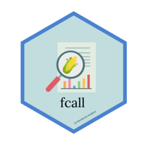
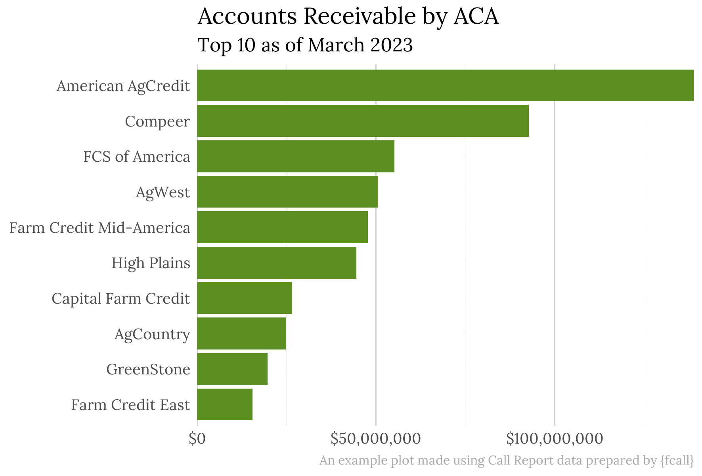

<!-- README.md is generated from README.Rmd. Please edit that file -->

```{r, include = FALSE}
knitr::opts_chunk$set(
  collapse = TRUE,
  comment = "#>",
  fig.path = "man/figures/README-",
  out.width = "100%"
)
```

# fcall 

<!-- badges: start -->
<!-- badges: end -->

R package for parsing Farm Credit Administration ("FCA") Call Report data into [tidy](https://tidyr.tidyverse.org/articles/tidy-data.html) R data frames.

<br>



## Installation

You can install {fcall} from [GitHub](https://github.com/) with:

``` r
# install.packages("remotes")
remotes::install_github("ketchbrookanalytics/fcall")
```

## Background

FCA publishes Call Report data on a quarterly basis at [https://www.fca.gov/bank-oversight/call-report-data-for-download](https://www.fca.gov/bank-oversight/call-report-data-for-download).

As of September 2023, this data represents a set of 72 *.TXT* files. These files represent 36 datasets. The files prefixed with "D_" contain *metadata* (the column names, data types, etc.) of the associated file containing the raw, header-less comma-separated data. For example, the file that starts with *"D_INST"* contains the metadata for the file that starts with *"INST_"*.

Further, some of these datasets are structured in a way that makes data analysis difficult. In these cases, we chose to pivot the data to make it more analysis-friendly. See [Metadata File Scenarios](#metadata-file-scenarios) for a more in-depth discussion of when and how this pivoting took place.

This package provides 3 utility functions:

1. `download_data()` allows users to programmatically download (and unzip) data from a specific quarter
2. `process_data()` parses the data from these unzipped *.TXT* files into a list of R data frames containing the Call Report data and file metadata
3. `compare_metadata()` compares two sets of Call Report data from different quarters

Check out the [Getting Started](https://ketchbrookanalytics.github.io/fcall/articles/getting-started.html) vignette to learn more about these three core functions.

## Database

[Ketchbrook Analytics](https://www.ketchbrookanalytics.com/) has also created a PostgreSQL database to store historical FCA Call Report data in a traditional, relational schema that aligns with the output data frame structure resulting from running `process_data()`. This database allows users to execute SQL queries to easily analyze Call Report data across multiple quarters.

Please reach out to [info@ketchbrookanalytics.com](mailto:info@ketchbrookanalytics.com?subject=FCA%20Call%20Report%20Database) if you would like access to this database.

#### Database Users

```{r echo=FALSE}
logos_data <- tibble::tribble(
  ~line, ~width, ~src, ~alt, ~href, 
  1, 220, "agwest_logo.png", "AgWest Farm Credit", "https://agwestfc.com", 
  1, 220, "greenstone_logo.jpg", "GreenStone Farm Credit Services", "https://www.greenstonefcs.com/", 
  1, 220, "highplains_logo.png", "High Plains Farm Credit", "https://highplainsfarmcredit.com/"
)

lines <- logos_data$line |> unique() |> sort()
```

```{r echo=FALSE}
purrr::map(lines, function(line_number) {
  logos_data |> 
    dplyr::filter(line == line_number) |> 
    purrr::pmap(function(line, width, src, alt, href) {
      
      htmltools::p(
        htmltools::a(
         href = href, target="_blank",
         htmltools::img(
            src = glue::glue("man/figures/{ src }"),
           width = width,
            alt = alt
          )
        ) 
      ) |> 
        htmltools::tagAppendAttributes(style = "display: flex; align-items:center")
    
    }) |> 
    do.call(htmltools::div, args = _) |> 
    htmltools::tagAppendAttributes(style = "display: flex; justify-content: space-evenly;")
}) |> 
  do.call(htmltools::div, args = _)
```
