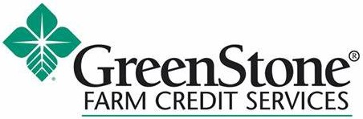

<!-- README.md is generated from README.Rmd. Please edit that file -->

# fcall <a href="https://ketchbrookanalytics.github.io/fcall/"></a>

<!-- badges: start -->
<!-- badges: end -->

R package for parsing Farm Credit Administration (“FCA”) Call Report
data into [tidy](https://tidyr.tidyverse.org/articles/tidy-data.html) R
data frames.

<br>


## Installation

You can install {fcall} from [GitHub](https://github.com/) with:

``` r
# install.packages("remotes")
remotes::install_github("ketchbrookanalytics/fcall")
```

## Background

FCA publishes Call Report data on a quarterly basis at
<https://www.fca.gov/bank-oversight/call-report-data-for-download>.

As of September 2023, this data represents a set of 72 *.TXT* files.
These files represent 36 datasets. The files prefixed with “D\_” contain
*metadata* (the column names, data types, etc.) of the associated file
containing the raw, header-less comma-separated data. For example, the
file that starts with *“D_INST”* contains the metadata for the file that
starts with *“INST\_”*.

Further, some of these datasets are structured in a way that makes data
analysis difficult. In these cases, we chose to pivot the data to make
it more analysis-friendly. See [Metadata File
Scenarios](#metadata-file-scenarios) for a more in-depth discussion of
when and how this pivoting took place.

This package provides 3 utility functions:

1.  `download_data()` allows users to programmatically download (and
    unzip) data from a specific quarter
2.  `process_data()` parses the data from these unzipped *.TXT* files
    into a list of R data frames containing the Call Report data and
    file metadata
3.  `compare_metadata()` compares two sets of Call Report data from
    different quarters

Check out the [Getting
Started](https://ketchbrookanalytics.github.io/fcall/articles/getting-started.html)
vignette to learn more about these three core functions.

## Database

[Ketchbrook Analytics](https://www.ketchbrookanalytics.com/) has also
created a PostgreSQL database to store historical FCA Call Report data
in a traditional, relational schema that aligns with the output data
frame structure resulting from running `process_data()`. This database
allows users to execute SQL queries to easily analyze Call Report data
across multiple quarters.

Please reach out to
[info@ketchbrookanalytics.com](mailto:info@ketchbrookanalytics.com?subject=FCA%20Call%20Report%20Database)
if you would like access to this database.

#### Database Users

<div>
<div style="display: flex; justify-content: space-evenly;">
<p style="display: flex; align-items:center">
<a href="https://agwestfc.com" target="_blank">

</a>
</p>
<p style="display: flex; align-items:center">
<a href="https://www.greenstonefcs.com/" target="_blank">

</a>
</p>
<p style="display: flex; align-items:center">
<a href="https://highplainsfarmcredit.com/" target="_blank">

</a>
</p>
</div>
<div style="display: flex; justify-content: space-evenly;">
<p style="display: flex; align-items:center">
<a href="https://www.cobank.com/" target="_blank">

</a>
</p>
<p style="display: flex; align-items:center">
<a href="https://www.farmcreditil.com/" target="_blank">

</a>
</p>
<p style="display: flex; align-items:center">
<a href="https://goldenstatefarmcredit.com/" target="_blank">

</a>
</p>
</div>
<div style="display: flex; justify-content: space-evenly;">
<p style="display: flex; align-items:center">
<a href="https://www.horizonfc.com/" target="_blank">

</a>
</p>
</div>
</div>
