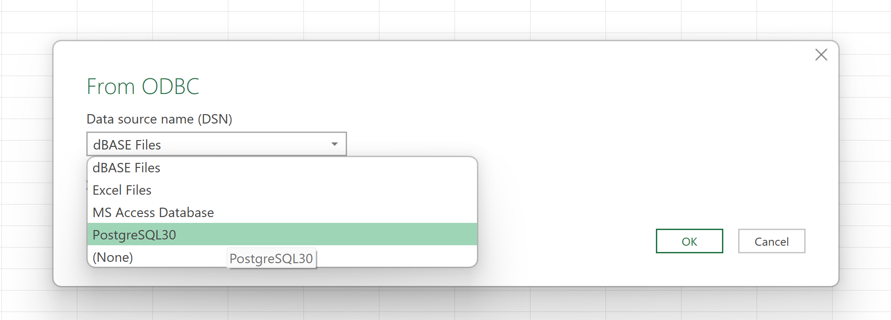

In addition to {fcall}, Ketchbrook Analytics has also developed a cloud-based PostgreSQL database which contains the curated Call Report data as tables in a traditional, relational SQL database. This provides the opportunity to connect from any application with access to an internet connection (e.g., Excel, Power BI, Tableau, etc.), as well as easily analyze the data *over time* (across multiple quarters).

Each table/column in the database is named consistently with the file/field naming conventions in the Call Report .zip file.

The following tutorial serves as a guide to connect Excel (on a Windows operating system) to the PostgreSQL database, though the principles remain the same regardless of the application or operating system.

## 1.0 - Download the psqlodbc Driver

In order to setup an ODBC connection between your local machine and the PostgreSQL database, first download and install the **psqlodbc** driver from [https://www.postgresql.org/ftp/odbc/releases](https://www.postgresql.org/ftp/odbc/releases). We recommend downloading the latest version that matches your computer's specifications (e.g., for 64-bit operating systems, download the file that ends in *"-x64.zip"*).

## 2.0 - Add an ODBC Data Source

Next, open the *ODBC Data Source Administrator* application on your local PC by searching for "ODBC Data Sources" in your "Start" menu or desktop search bar. On the "Drivers" tab, you should see multiple ODBC Drivers installed that have a name that starts with "PostgreSQL...".

 

 

Navigate back to the "User DSN" tab and click the "Add" button in the upper right-hand side of the ODBC Data Source.

 

 

In the pop-up window, select the appropriate PostgreSQL ANSI driver that matches your system specifications. For most users this will be "PostgreSQL ANSI(x64)". Then select "Finish".

 

 

On the last screen, enter the connection credentials provided by Ketchbrook Analytics (Database, Server, Port, User Name, and Password), and set SSL Mode to "require". The click "Save".

 

 

You have now successfully established a connection between your PC and the PostgreSQL cloud database hosted by Ketchbrook Analytics.

## 3.0 - Query the Database from Excel

In an Excel workbook, navigate to the "Data" tab. Click the "Get Data" button on the left-hand side of the ribbon, and select "From Other Sources", then "From ODBC".

 

 

In the pop-up window, select the "PostgreSQL" option that matches the name of the ODBC connection you set up in Step 2.

Optionally, you can expand the "Advanced Options" and write a custom SQL query against the database. However, most users will find simply clicking the "OK" button and moving into the Power Query interface the preferred method of querying the database.

 

 

On the next screen, select the database table to query. Note that the curated metadata files are also stored in the database (as the tables that start with *"D_"*). Once a table has been selected, select "Load" to immediately load the entire table into your Excel workbook, or "Transform Data" to launch the Power Query editor and leverage the suite of ETL tools available through the Power Query interface.

 

 
